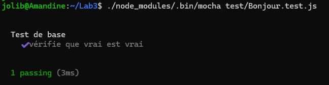

# Rapport de TP - DA51 Lab Session 3 : Smart Contracts avec Solidity

# JOLIBOIS Amandine

[**Lien Github**](https://github.com/amandine-jolibois/Smart-contract)

---

## 🎯 Objectifs du TPrm -rf https:/


Ce TP a pour but de découvrir et pratiquer le développement de contrats intelligents (smart contracts) avec le langage **Solidity**, leur **compilation**, leur **test** et leur **déploiement simulé** dans une blockchain Ethereum privée. À l’issue du TP, nous avons appris à :
- Écrire un smart contract en Solidity
- Utiliser `solc` pour compiler le contrat et générer l’ABI et le bytecode
- Créer un script `compile.js` pour automatiser la compilation
- Créer un test unitaire en JavaScript avec le framework **Mocha**
- Utiliser **Ganache** pour simuler une blockchain locale

---

## 🧰 Pré-requis et installation

### Logiciels utilisés :
- [Node.js](https://nodejs.org)
- NPM (Node Package Manager)
- solc (compilateur Solidity)
- Ganache CLI
- Web3.js
- Mocha (framework de test)

### Commandes d’installation :

```bash
sudo npm install -g solc
npm install --save solc mocha ganache-cli web3
```

Lab3/
├── contracts/
│   └── Bonjour.sol
├── compile.js
├── test/
│   └── Bonjour.test.js
├── package.json

```Bonjour.sol
// SPDX-License-Identifier: UTBM
pragma solidity >=0.8.0 <0.9.0;

contract Bonjour {
    string message;

    constructor(string memory initialMessage) {
        message = initialMessage;
    }

    function setBonjour(string memory newMessage) public {
        message = newMessage;
    }

    function getBonjour() public view returns (string memory) {
        return (message);
    }
}
```

- Ce contrat permet de stocker un message (type string) qui peut être modifié et lu via des fonctions setter et getter.

```bash
solc --combined-json abi,bin,metadata --output-dir . contracts/MyLab3SContract.sol
```

# Fichier généré : combined.json, contenant :

- abi : interface du contrat

- bin : bytecode du contrat

- metadata : informations sur la compilation et le contrat

Ce script lit le contrat .sol, le compile avec solc et retourne l’abi + le bytecode.

```javascript
const path = require('path');
const fs = require('fs');
const solc = require('solc');

const MyLab3SContractPath = path.resolve(__dirname, "contracts", "MyLab3SContract.sol");

const compilerInput = {
  language: "Solidity",
  sources: {
    'MyLab3SContract': { content: fs.readFileSync(MyLab3SContractPath, 'utf8') }
  },
  settings: {
    outputSelection: {
      "*": {
        "*": ["abi", "evm.bytecode"]
      }
    }
  }
};

module.exports = JSON.parse(solc.compile(JSON.stringify(compilerInput)));
```

# Fichier test/MyLab3SContract.test.js :

```javascript
const assert = require('assert');
const ganache = require('ganache-cli');
const Web3 = require('web3');
const web3 = new Web3(ganache.provider());

let accounts;

beforeEach(async () => {
  accounts = await web3.eth.getAccounts();
});

describe('MyLab3SContract', () => {
  it('Deploy a contract', () => {
    console.log(accounts);
  });
});
```

- Dans package.json :

```json
"scripts": {
  "test": "mocha"
}
```
```bash
npm test


  Bonjour
[
  '0xB6E0a844...', 
  ...
  '0x586BBF31...'
]
    ✔ Deploy a contract
```

- Le test affiche les 10 adresses générées par Ganache, confirmant que les comptes ont été créés et accessibles.

